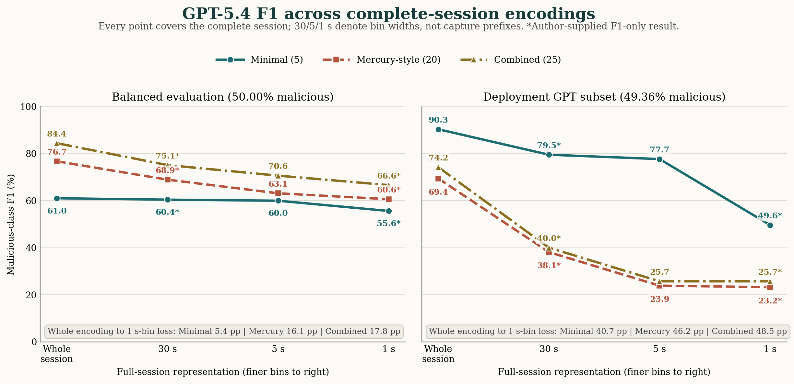
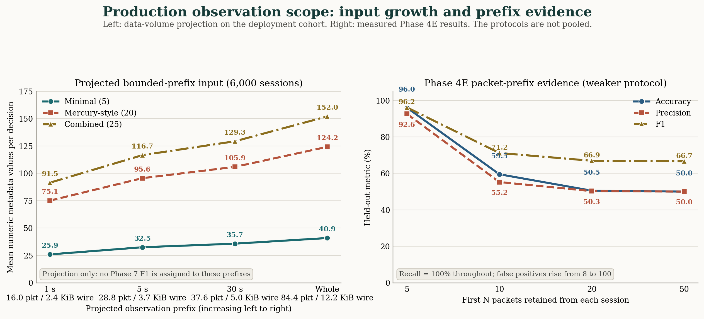

# Payload-Free Malware Traffic Detection

This repository evaluates local supervised classifiers and prompted language
models on encrypted or payload-free network metadata. The primary protocol is
session based and capture disjoint: every test fold holds out one complete
malware capture and its associated family while training and validation use
different captures.

The public repository contains experiment code, tests, figures, and compact
result summaries. Packet captures, SQLite databases, split manifests, API
checkpoints, and prediction-level outputs are intentionally excluded.

## What Is Evaluated

Phase 7 is the current session experiment suite. It crosses three feature sets,
three serialization units, two evaluation modes, and several detector families.

| Dimension | Configurations |
|---|---|
| Feature set | `minimal`, `mercury`, `combined` |
| Serialization unit | whole-session `session_sequence`, complete-session fixed-duration `behavior_window` bins, single-packet `packet_ablation` |
| Evaluation mode | `balanced`, `deployment` |
| Local detector | RF, XGBoost, LightGBM, CART, KNN |
| Prompted detector | OpenAI GPT-5.4 or Anthropic Claude Sonnet 4.6, blind or training-memory context |
| Supervised LLM | fine-tuning export, job creation, and held-out evaluation path |
| Primary split | `capture_disjoint_5fold` |
| Secondary split | `within_capture_temporal` seen-capture upper bound |

`session_sequence` summarizes the complete eligible session in ordered
packet-count segments. Despite its name, `behavior_window` does **not** truncate
the observation to the first 1, 5, or 30 seconds and does not create one sample
per time window. It partitions the same complete session into nonempty
fixed-duration bins and compresses them to at most 32 ordered summaries.
Consequently, the Phase 7 window sweep tests representation granularity, not
early-stream detection or reduced capture volume. `packet_ablation` is retained
only to compare against simpler packet-level experiments.

### Feature Sets

`minimal` contains five side-channel fields: packet size, payload
size, payload ratio, size ratio to the preceding packet, and inter-arrival time.

`mercury` contains 20 efficiently derived Mercury-style metadata fields:
direction, direction change, TCP/UDP indicators, encrypted-session hint, source,
destination, and inferred service ports, well-known/ephemeral port indicators,
TLS/DNS/web service hints, normalized packet position, elapsed session time,
log inter-arrival time, packet-size delta, and payload-size delta.

These are **Mercury-style fields**, not Cisco Mercury fingerprints. The local
schema does not include raw TLS extensions, SSH fingerprints, HTTP fingerprints,
or TCP-option fingerprints. `combined` is the union of the 5 minimal and 20
Mercury-style fields.

### Evaluation Modes

`balanced` creates an equal benign/malicious held-out cohort in each frozen fold
and evaluates the fixed decision threshold. It is intended for controlled,
apples-to-apples scientific comparisons. The exact evaluated class composition
is shown below; counts are per feature/context variant and are not multiplied by
the number of detectors.

`deployment` retains the class prevalence in the eligible held-out capture
cohort. A threshold is selected **only on the validation partition** by
maximizing recall subject to the configured validation false-positive-rate
ceiling, then applied once to the test partition. This is prevalence faithful to
the study corpus, not to an enterprise network; the corpus itself is much more
malware dense than operational traffic.

| Mode and test path | Benign test samples | Malicious test samples | Total |
|---|---:|---:|---:|
| Balanced, local complete-session representation | 2,140 (50.00%) | 2,140 (50.00%) | 4,280 |
| Balanced, local packet ablation | 1,070 (50.00%) | 1,070 (50.00%) | 2,140 |
| Balanced, expanded GPT variant | 260 (50.00%) | 260 (50.00%) | 520 |
| Deployment, local complete-session representation | 2,823 (47.05%) | 3,177 (52.95%) | 6,000 |
| Deployment, expanded GPT variant | 557 (50.64%) | 543 (49.36%) | 1,100 |

The complete deployment folds are highly heterogeneous: their malicious rates
are 30.69%, 29.22%, 74.79%, 44.29%, and 74.85% for the five held-out captures.
The budgeted GPT test subset preserves this fold-level imbalance approximately,
but its fixed 220 decisions per fold produce a slightly lower pooled rate of
49.36% malicious. Deployment packet ablation is not reported because one
validation fold fails the minimum class-support requirement.

## Current Audited Results

We report pooled malicious-class F1 by summing the confusion counts from all five
held-out capture folds and then computing F1. This weights every evaluated sample
equally and avoids treating five heterogeneous malware captures as if they were
interchangeable repeated measurements. Fold-level results remain available in
the published JSON summaries and should accompany any pooled value.

### LLM Results

Table 1 reports every configuration in the expanded, memory-enabled GPT-5.4
complete-session runs for which full confusion counts are available. Balanced
cells contain 520 held-out decisions per variant
(104 per fold, equally divided by class). Deployment cells contain 1,100 test
decisions per variant (220 per fold, 49.36% malicious); their thresholds were
selected using separate validation requests and were never tuned on these test
labels.

| Evaluation | Representation | Features | Test n | Accuracy | Precision | Recall | Pooled F1 | Mean s/query |
|---|---|---|---:|---:|---:|---:|---:|---:|
| Balanced | Whole session | Minimal | 520 | 70.00% | 87.14% | 46.92% | 61.00% | 1.909 |
| Balanced | Complete session, 5 s bins | Minimal | 520 | 66.35% | 74.01% | 50.38% | 59.95% | 1.813 |
| Balanced | Whole session | Mercury-style | 520 | 79.81% | 90.58% | 66.54% | 76.72% | 1.799 |
| Balanced | Complete session, 5 s bins | Mercury-style | 520 | 65.38% | 67.54% | 59.23% | 63.11% | 1.875 |
| Balanced | Whole session | Combined | 520 | 85.58% | 91.86% | 78.08% | **84.41%** | 1.850 |
| Balanced | Complete session, 5 s bins | Combined | 520 | 71.35% | 72.47% | 68.85% | 70.61% | 1.823 |
| Deployment | Whole session | Minimal | 1,100 | 90.36% | 89.51% | 91.16% | **90.33%** | 1.802 |
| Deployment | Complete session, 5 s bins | Minimal | 1,100 | 79.55% | 84.27% | 72.01% | 77.66% | 1.742 |
| Deployment | Whole session | Mercury-style | 1,100 | 76.27% | 95.48% | 54.51% | 69.40% | 1.717 |
| Deployment | Complete session, 5 s bins | Mercury-style | 1,100 | 53.00% | 59.56% | 14.92% | 23.86% | 1.768 |
| Deployment | Whole session | Combined | 1,100 | 79.27% | 96.19% | 60.41% | 74.21% | 1.768 |
| Deployment | Complete session, 5 s bins | Combined | 1,100 | 52.18% | 55.15% | 16.76% | 25.71% | 1.722 |

The completed four-representation sweep shows a consistent
serialization-performance gradient for GPT-5.4. From the whole-session
packet-segment encoding to complete-session 1 s bins, balanced F1 decreases by
5.40 points with minimal features, 16.12 points with Mercury-style features,
and 17.81 points with combined features. The corresponding deployment losses
are 40.73, 46.20, and 48.51 points. The location of the loss differs by feature
set: Mercury-style and combined deployment F1 have already fallen by 31.30 and
34.21 points under 30 s binning, whereas minimal features retain 79.50% with
30 s bins and 77.66% with 5 s bins before dropping to 49.60% with 1 s bins.
No packets are omitted by these bin-width changes.

The stored whole-session and 5 s-bin confusion matrices expose the error
mechanism for those representations. Mercury-style and combined deployment
recalls fall to 14.92% and 16.76% at 5 s, respectively, so their low F1 is
driven primarily by missed malicious test instances rather than by a
precision-only tradeoff. The best
whole-session deployment run still has a 10.41% pooled test FPR despite selecting
thresholds under a 5% validation FPR constraint. This validation-to-test gap
demonstrates capture-dependent calibration shift; test labels were not used for
threshold selection. The author-supplied 30 s-bin/1 s-bin records contain F1
only, so their error composition cannot be decomposed further from the published
data.

Phase 4E provides the repository's actual bounded-prefix evidence. It used a
different and weaker protocol: 200 balanced sessions were sampled without a
capture-disjoint train/validation/test boundary, and each prompt received only
the first 5, 10, 20, or 50 packets. It is therefore retained as a preliminary
prefix-feasibility and prompt-sensitivity check, not as a result that can be
pooled with Phase 7.

| Phase 4E first-packet prefix | Accuracy | Precision | Recall | F1 | Prediction behavior |
|---:|---:|---:|---:|---:|---|
| 5 packets | 96.00% | 92.59% | 100.00% | 96.15% | 8 false positives |
| 10 packets | 59.50% | 55.25% | 100.00% | 71.17% | 81 false positives |
| 20 packets | 50.50% | 50.25% | 100.00% | 66.89% | 99 false positives |
| 50 packets | 50.00% | 50.00% | 100.00% | 66.67% | all samples predicted malicious |

Phase 4E exhibits the opposite numeric ordering from the capture-disjoint
complete-session bin-width sweep: the five-packet prefix performs best, while
longer packet prefixes collapse toward an all-malicious decision. The 96.15%
five-packet F1 shows that early-prefix classification can be feasible on this
sample, but the reversal is consistent with a protocol- or prompt-specific
failure, not evidence that longer observation is intrinsically harmful. The
results cannot be merged because their units, cohorts, provider metadata, and
leakage controls differ. The recovered source,
`llm_results_openai_verbose.json`, contains no model field; it therefore
cannot support a Claude Sonnet attribution. Claude Sonnet 4.6 remains executable
through the current provider path, but no provider-identified Sonnet session
artifact is claimed here.

### Local ML and Ensembles

The local suite evaluates complete held-out folds rather than budgeted subsets.
Table 2 gives the best model/feature combination for each complete-session
representation. Table 3 reports the corresponding worst combination, selected
by pooled malicious F1 over all five detectors and three feature sets. The three
comparison figures below expose every individual cell.

| Evaluation | Representation | Best detector | Best features | Best accuracy | Best precision | Best recall | Best pooled F1 |
|---|---|---|---|---:|---:|---:|---:|
| Balanced | Whole session | CART | Mercury-style | 89.56% | 93.34% | 85.19% | **89.08%** |
| Balanced | Complete session, 30 s bins | KNN | Combined | 88.95% | 92.63% | 84.63% | 88.45% |
| Balanced | Complete session, 5 s bins | KNN | Combined | 88.95% | 92.55% | 84.72% | 88.46% |
| Balanced | Complete session, 1 s bins | CART | Mercury-style | 89.28% | 93.39% | 84.53% | 88.74% |
| Balanced | Packet ablation | RF | Combined | 92.48% | 92.20% | 92.80% | **92.50%** |
| Deployment | Whole session | RF | Minimal | 83.75% | 92.06% | 75.86% | 83.18% |
| Deployment | Complete session, 30 s bins | RF | Minimal | 83.67% | 92.40% | 75.35% | 83.01% |
| Deployment | Complete session, 5 s bins | RF | Minimal | 84.20% | 92.91% | 75.95% | 83.58% |
| Deployment | Complete session, 1 s bins | CART | Combined | 85.30% | 92.08% | 79.04% | **85.06%** |
| Deployment | Packet ablation | -- | -- | -- | -- | -- | Unsupported |

| Evaluation | Representation | Worst detector | Worst features | Worst accuracy | Worst precision | Worst recall | Worst pooled F1 |
|---|---|---|---|---:|---:|---:|---:|
| Balanced | Whole session | CART | Combined | 88.15% | 91.38% | 84.25% | 87.67% |
| Balanced | Complete session, 30 s bins | CART | Combined | 79.14% | 89.49% | 66.03% | **75.99%** |
| Balanced | Complete session, 5 s bins | KNN | Minimal | 78.55% | 89.57% | 64.63% | **75.08%** |
| Balanced | Complete session, 1 s bins | CART | Combined | 79.04% | 89.46% | 65.84% | **75.85%** |
| Balanced | Packet ablation | KNN | Mercury-style | 88.88% | 89.85% | 87.66% | 88.74% |
| Deployment | Whole session | LightGBM | Mercury-style | 80.05% | 85.28% | 75.32% | 79.99% |
| Deployment | Complete session, 30 s bins | XGBoost | Mercury-style | 80.00% | 85.37% | 75.10% | 79.91% |
| Deployment | Complete session, 5 s bins | XGBoost | Mercury-style | 79.95% | 85.25% | 75.13% | 79.87% |
| Deployment | Complete session, 1 s bins | XGBoost | Mercury-style | 80.02% | 85.35% | 75.17% | 79.93% |
| Deployment | Packet ablation | -- | -- | -- | -- | -- | Unsupported |

Deployment packet ablation fails closed because fold 0 has only 60 malicious
validation samples, below the configured minimum support of 100. Reporting no
score is preferable to thresholding on an underpowered validation set. Across
the four complete-session representations, RF and XGBoost are nearly invariant
to serialization granularity: within any feature/evaluation series, their F1
ranges are at most 0.57 points. Balanced LightGBM spans at most 0.08 points; its
largest deployment span is 2.17 points for Mercury-style features. This is
qualitatively different
from GPT-5.4's 5.40-48.51 point whole-encoding-to-1 s-bin losses. Stability is
not universal among local learners: balanced KNN falls to 75.08% with minimal
5 s bins,
while CART falls to approximately 76% for combined 30 s and 1 s bins. These
are isolated model/representation interactions rather than the systematic
decline observed across every GPT feature set and both evaluation modes.

Across the 120 supported local complete-session summary cells, throughput derived
from recorded test size and prediction time spans approximately 2.5 thousand to
1.47 million samples/s (median approximately 207 thousand), versus 1.72-1.91
seconds per remote GPT request. The measurements are not hardware-normalized,
but they establish that the prompted detector operates in a fundamentally
different latency regime.

### Cross-Model Comparison

The following figures compare the whole-session packet-segment encoding with
complete-session 30 s, 5 s, and 1 s binning. They do not order the amount of
traffic observed: every `behavior_window` sample still contains its complete
eligible session. Every cell reports malicious-class F1. Local values and
GPT-5.4 whole/5 s-bin values are recomputed from stored confusion counts;
asterisked GPT-5.4 30 s-bin/1 s-bin values are additional measurements supplied
by the project author. Their raw predictions, confusion counts, class supports,
and latencies are not present in this repository, so those cells cannot be
independently recomputed and are not used in the detailed LLM table above.

The descriptive best-feature envelope changes sharply with serialization. In
balanced evaluation, the best GPT/local F1 values are 84.41/89.08% for the
packet-segment whole-session representation, 75.10/88.45% with 30 s bins,
70.61/88.46% with 5 s bins, and 66.60/88.74% with 1 s bins. In deployment
evaluation they are 90.33/83.18%, 79.50/83.01%, 77.66/83.58%, and
49.60/85.06%, respectively. GPT therefore leads the best local baseline only in
the whole-session deployment comparison, by 7.15 points; under 1 s binning, the
best local result leads GPT by 22.14 points in balanced evaluation and 35.46
points in deployment evaluation. These post hoc envelopes summarize the
observed result matrix and are not a feature-selection procedure.

#### LLM Sensitivity to Full-Session Binning



[Vector PDF](figures/session_llm_context_degradation.pdf). The figure isolates
the three GPT-5.4 feature trajectories. In balanced evaluation, minimal-feature
F1 is nearly flat from packet-segment encoding through 5 s binning (61.00% to
59.95%) before falling to 55.60% with 1 s bins. Mercury-style and combined
features degrade under each finer serialization, losing 16.12 and 17.81 points
from packet segments to 1 s bins. Richer metadata therefore improves GPT under
the packet-segment representation but is more sensitive to how the same session
is serialized; this experiment does not remove later traffic.

Deployment evaluation shows two distinct failure shapes. Mercury-style and
combined F1 collapse with 30 s bins, from 69.40% to 38.10% and from 74.21% to
40.00%, then approach approximately 24-26% with 5 s bins. Minimal features
retain 79.50% with 30 s bins and 77.66% with 5 s bins, but fall to 49.60% with
1 s bins. Across all three feature sets, packet-segment encoding is best and
1 s binning is worst; the corresponding deployment losses are 40.73, 46.20,
and 48.51 points. The connecting lines order four categorical encodings and do
not estimate performance at untested bin widths or capture prefixes.

#### Minimal Features


[Vector PDF](figures/session_granularity_minimal.pdf). Minimal metadata is the
least serialization-sensitive balanced GPT configuration: F1 remains within
1.05 points of the packet-segment result through 5 s binning, then loses a
further 4.35 points with 1 s bins. Deployment behavior is nonlinear. F1 declines
from 90.33% to 79.50% with 30 s bins and 77.66% with 5 s bins, followed by a
28.06-point 5-to-1 s-bin collapse. RF, XGBoost, and LightGBM do not reproduce
that collapse; balanced KNN with 5 s bins is the principal local exception.

#### Mercury-Style Features


[Vector PDF](figures/session_granularity_mercury.pdf). Mercury-style metadata
improves balanced packet-segment GPT F1 by 15.72 points over minimal metadata,
but that advantage contracts to 5.00 points with 1 s bins. Deployment
performance is substantially more brittle: F1 loses 31.30 points with 30 s
bins, 45.54 points with 5 s bins, and 46.20 points with 1 s bins. The near
plateau between 5 s and 1 s (23.86% versus 23.20%) indicates that most of the
representation-associated failure has already occurred with 5 s binning. Local
Mercury-style results remain near 80-89% across all four representations.

#### Combined Features


[Vector PDF](figures/session_granularity_combined.pdf). Combining both feature
families produces the strongest balanced GPT result under every representation,
but its advantage over the other GPT feature sets does not make it
serialization invariant: F1 loses 9.31 points with 30 s bins and 17.81 points
with 1 s bins. Under deployment prevalence, combined features lose 34.21 points
with 30 s bins and produce nearly the same low F1 with 5 s and 1 s bins (25.71%
and 25.70%). RF, XGBoost, and LightGBM remain close to their packet-segment
scores. CART's isolated balanced failures with 30 s and 1 s bins show why
model-specific cells must remain visible instead of reporting only the best
local detector.

The completed sweep establishes that GPT-5.4 is sensitive to full-session
serialization: all six feature/evaluation trajectories attain their highest F1
under packet-segment encoding and their lowest F1 under 1 s binning (the
combined deployment 5 s and 1 s values are tied to one decimal place). Because
every representation retains the complete session, this pattern cannot be
attributed to omitted long-range events. Plausible mechanisms include increased
feature repetition under finer bins, compression of long sessions into the
32-summary cap, distribution shift between memory examples and test prompts,
and cross-capture threshold transfer. The training asymmetry may also matter:
local models are fitted directly to all eligible profile vectors, whereas GPT
receives a budgeted memory prompt rather than representation-specific supervised
optimization. These mechanisms are not separately identified by the experiment.

### Production Input Requirements and Prefix Evidence



[Vector PDF](figures/session_production_input_tradeoff.pdf). The left panel is a
data-volume projection over the frozen 6,000-session deployment cohort, not an
accuracy experiment. It truncates each packet stream at 1 s, 5 s, and 30 s and
then applies the current ordered packet-segment serializer. The right panel
shows Phase 4E's actual first-5/10/20/50-packet measurements under its separate,
weaker protocol. The panels are deliberately not pooled.

| Hypothetical decision point | Mean packets observed | Mean wire KiB observed | Minimal values | Mercury values | Combined values |
|---|---:|---:|---:|---:|---:|
| First 1 s | 16.01 | 2.39 | 25.94 | 75.11 | 91.50 |
| First 5 s | 28.85 | 3.74 | 32.47 | 95.61 | 116.65 |
| First 30 s | 37.58 | 4.99 | 35.75 | 105.92 | 129.32 |
| Completed session | 84.42 | 12.24 | 40.89 | 124.24 | 152.02 |

The prefix projection supports a narrow production argument: closing a decision
after a bounded prefix can reduce decision delay, flow-state lifetime, and the
metadata summarized before classification. In this cohort, a first-1 s policy
observes 16.01 packets and 2.39 KiB per session on average, versus 84.42 packets
and 12.24 KiB for completed sessions. The projected scalar metadata also grows
monotonically from 25.94/75.11/91.50 values at 1 s to
40.89/124.24/152.02 values at completion for minimal/Mercury/combined inputs.
These counts exclude JSON syntax, feature names, system instructions, memory
examples, and generated output.

It does not follow that the existing Phase 7 1 s/5 s/30 s F1 values quantify
that tradeoff. The audited eligible deployment cohorts for all four Phase 7
representations are constructed from the same 6,000 sessions, 506,505 packet
rows, and 75,214,748 observed wire bytes; the budgeted GPT experiments evaluate
frozen subsets of that cohort. Finer binning can even increase prompt structure:
mean reported summaries rise from 2.78 for packet segments to 4.99 for 1 s bins.
In the available whole-versus-5 s API records, mean total tokens range from a
4.7% decrease to an 8.4% increase, depending on feature set and evaluation mode;
5 s binning is not a reliable input-cost reduction.

Phase 4E does measure bounded packet prefixes, but it is preliminary evidence.
Its five-packet F1 is 96.15%; by 50 packets, F1 is 66.67% because every sample is
predicted malicious. The missing model identity, balanced 200-session sample,
absence of capture-disjoint folds, and lack of validation-only thresholding
preclude a production-accuracy claim. A publishable early-detector comparison
requires frozen capture-disjoint first-1 s/5 s/30 s prefixes, balanced and
prevalence-faithful tests, validation-only thresholds, and one final test
evaluation. It must retain sessions with sparse prefixes or specify an
abstention policy rather than silently filtering them after observing the label.

The cohort also does not justify a broad claim that completed-session detection
is infeasible on gigabit enterprise networks. A metadata-only sensor need not
retain packet payloads, and the median completed session here is only 18 packets
and 1,486 observed bytes. The long tail is material, however: the largest
session has 86,157 packets and 18,620,487 observed bytes. Whole-session
deployment therefore raises real latency and concurrent-flow-state concerns,
but enterprise arrival rate, flow concurrency, memory footprint, and sustained
throughput were not measured. Those systems quantities, rather than aggregate
link bandwidth alone, are required for a defensible scalability claim.

Important scope limits remain. The corpus contains seven benign and five
malicious captures, with one malicious capture per evaluated family. Every
complete-session representation requires at least six packets per session.
Local and LLM inputs share base
metadata and split manifests, but their tabular and textual representations are
not byte-identical. Local models use full folds, whereas GPT uses frozen budgeted
subsets. Blind prompting, Sonnet 4.6, and fine-tuning paths exist in code but are
not represented by completed capture-disjoint artifacts in these tables.

See [`results/published/README.md`](results/published/README.md) for fold-level
records, provenance, and source-artifact hashes. Regenerate the five figures
with `python scripts/create_session_granularity_chart.py`.

## Installation

Python 3.11 or newer is recommended. XGBoost and LightGBM are required for the
complete local suite; Phase 2 and Phase 7 fail clearly if requested algorithms
are unavailable.

```powershell
python -m venv .venv
.\.venv\Scripts\Activate.ps1
python -m pip install --upgrade pip
python -m pip install -r requirements.txt
```

API credentials must be supplied through environment variables, never committed
to `configs/config.py`:

```powershell
$env:OPENAI_API_KEY = "your-openai-key"
$env:ANTHROPIC_API_KEY = "your-anthropic-key"
```

The provider and model defaults are configured in `configs/config.py` under
`LLM_CONFIG`. The checked-in defaults are OpenAI `gpt-5.4` and Anthropic
`claude-sonnet-4-6`. Anthropic documents that dateless 4.6 ID as a
[pinned model](https://platform.claude.com/docs/en/about-claude/models/model-ids-and-versions),
not an evergreen alias. Select the provider with `--provider openai` or
`--provider anthropic`.

## Data Preparation

The dataset is not distributed through Git. Download the configured public CTU
captures and build the local database as follows:

```powershell
python run_all.py --phase 0
python run_all.py --phase 1 --rebuild-db
```

If `data/traffic.db` was already built from the same raw captures with the current
extractor and contains packet, session, capture, label, and family metadata, it
can be reused. Phase 7 derives session representations and frozen split manifests
from that database; it does not require a second extraction merely because the
session experiments are enabled.

Before spending API budget, validate the command and prompt construction:

```powershell
python run_all.py --phase 7 --session-mode llm --provider openai --dry-run
python run_all.py --phase 7 --session-mode llm --provider anthropic --dry-run
```

## Reproducing Phase 7

### Local Baselines

Balanced scientific comparison:

```powershell
python run_all.py --phase 7 --session-split-mode capture_disjoint_5fold --session-eval-mode balanced --session-mode local
```

Deployment-prevalence evaluation with validation-only threshold selection:

```powershell
python run_all.py --phase 7 --session-split-mode capture_disjoint_5fold --session-eval-mode deployment --session-mode local
```

The two local commands are read-only with respect to `data/traffic.db`, but they
write manifests and result files. Run them sequentially when first creating
manifests. Once manifests exist, parallel execution is normally safe because
manifest writes are locked and results use mode-specific filenames.

### Budgeted LLM Pilots

Balanced pilot, 780 calls for three feature sets, two session units, five folds,
and memory context:

```powershell
python run_all.py --phase 7 --session-split-mode capture_disjoint_5fold --session-eval-mode balanced --session-mode llm --provider openai --session-llm-context memory --session-budget-profile paper_5k --session-feature-set minimal,mercury,combined --session-sample-unit session_sequence,behavior_window
```

Deployment pilot, 2,400 calls including validation and test requests:

```powershell
python run_all.py --phase 7 --session-split-mode capture_disjoint_5fold --session-eval-mode deployment --session-mode llm --provider openai --session-llm-context memory --session-budget-profile paper_6k --session-feature-set minimal,mercury,combined --session-sample-unit session_sequence,behavior_window
```

To run the same matrix with Claude Sonnet 4.6, change only
`--provider openai` to `--provider anthropic`. Provider-specific result names
prevent an OpenAI run and an Anthropic run from overwriting each other.

### Expanded Published LLM Runs

Balanced expanded run, 3,120 held-out test calls:

```powershell
python run_all.py --phase 7 --session-split-mode capture_disjoint_5fold --session-eval-mode balanced --session-mode llm --provider openai --session-llm-context memory --session-budget-profile paper_5k --session-feature-set minimal,mercury,combined --session-sample-unit session_sequence,behavior_window --session-llm-samples-per-repeat 104 --session-llm-max-calls 5000
```

Deployment expanded run, 9,600 calls including 3,000 validation and 6,600 test
requests:

```powershell
python run_all.py --phase 7 --session-split-mode capture_disjoint_5fold --session-eval-mode deployment --session-mode llm --provider openai --session-llm-context memory --session-budget-profile paper_6k --session-feature-set minimal,mercury,combined --session-sample-unit session_sequence,behavior_window --session-llm-validation-samples-per-repeat 100 --session-llm-test-samples-per-repeat 220 --session-llm-max-calls 10000
```

Estimate calls before execution as:

```text
balanced = variants * folds * test_samples_per_fold
deployment = variants * folds * (validation_samples_per_fold + test_samples_per_fold)
```

Here, `variants = feature_sets * sample_units * window_settings * context_modes`.
`--session-llm-max-calls` is a hard preflight budget guard. Different profiles or
sample overrides produce distinct hashed output names. Repeating an identical
command resumes/reuses its checkpoint rather than intentionally creating a
duplicate run; preserve a complete `results/` directory before forcing a fresh
replicate.

### Blind, Memory, and Fine-Tuned LLMs

Use `--session-llm-context blind`, `memory`, or `both`. Memory examples are drawn
only from the fold's training partition; validation and test labels are never
inserted into prompts.

Prepare fine-tuning corpora without starting a provider job:

```powershell
python run_all.py --phase 7 --session-split-mode capture_disjoint_5fold --session-mode finetune --provider openai
```

Starting a paid OpenAI fine-tuning job requires explicit confirmation through the
command flag:

```powershell
python run_all.py --phase 7 --session-split-mode capture_disjoint_5fold --session-mode finetune --provider openai --start-finetune-job
```

Evaluate an existing fine-tuned model with `--finetuned-model MODEL_ID`. A
fine-tuned result is publishable only for the held-out fold associated with the
exported training corpus.

## Earlier Phases

Phases 2-6 remain available for reproducing the simpler packet-level and
adversarial ablations:

```text
0  dataset acquisition
1  packet extraction and SQLite construction
2  RF/XGBoost/LightGBM grouped local baselines
3  CART, KNN, and other classical baselines
4  packet-era OpenAI or Claude prompted experiments
5  cross-model analysis
6  adversarial evaluation
7  capture-disjoint session experiment suite
```

Use `python run_all.py --help` for all controls.

## Results and Verification

Raw outputs are written under `results/` and ignored by Git. Export compact,
shareable summaries after new runs:

```powershell
python scripts/export_publishable_results.py
```

Run the source and protocol tests before interpreting results:

```powershell
python -m pytest -q
python -m compileall -q configs src run_all.py scripts tests
```

Repository layout:

```text
configs/                 model, feature, budget, and protocol settings
src/                     extraction and experiment implementations
src/adversarial/         Phase 6 perturbation and evasion code
tests/                   deterministic split and protocol regression tests
scripts/                 compact result exporter and chart generator
results/published/       auditable summary JSONs only
figures/                 publication-facing aggregate figures
```

The repository does not claim that the current corpus represents production
base rates, that five held-out malware captures establish universal family
generalization, or that budgeted LLM subsets are equivalent to full-fold local
evaluation. Those limitations should remain explicit in any paper derived from
these artifacts.
