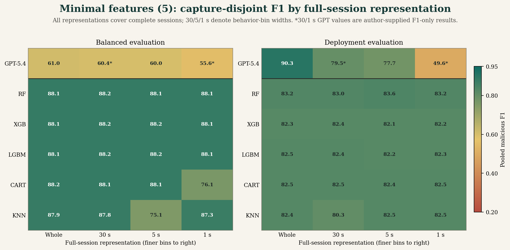
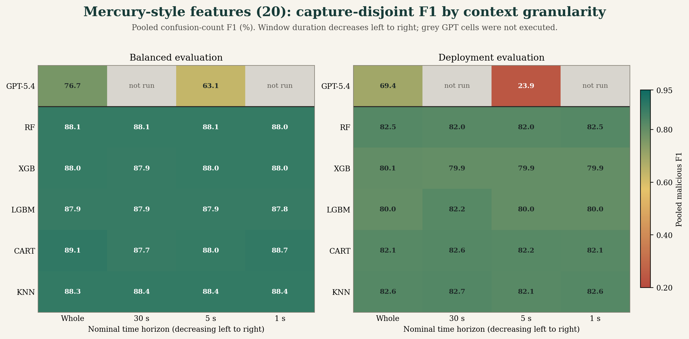
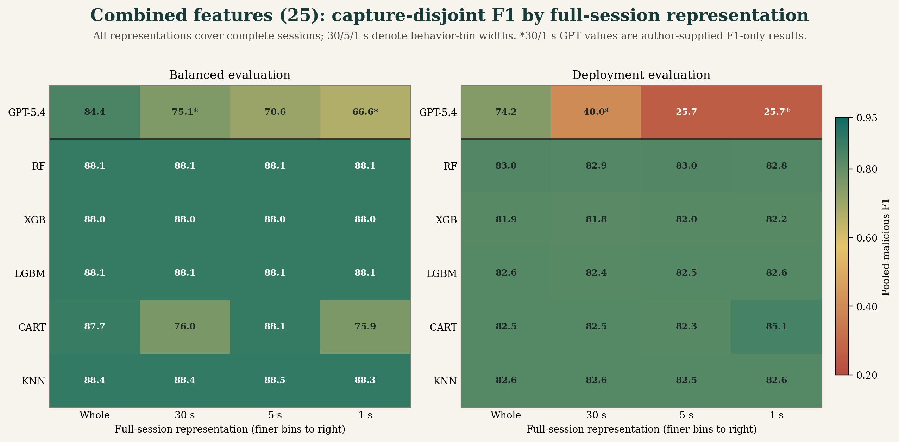

# Payload-Free Malware Traffic Detection

This repository evaluates local supervised classifiers and prompted language
models on encrypted or payload-free network metadata. The primary protocol is
session based and capture disjoint: every test fold holds out one complete
malware capture and its associated family while training and validation use
different captures.

The public repository contains experiment code, tests, figures, and compact
result summaries. Packet captures, SQLite databases, split manifests, API
checkpoints, and prediction-level outputs are intentionally excluded.

## What Is Evaluated

Phase 7 is the current session experiment suite. It crosses three feature sets,
three observation units, two evaluation modes, and several detector families.

| Dimension | Configurations |
|---|---|
| Feature set | `minimal`, `mercury`, `combined` |
| Observation unit | whole `session_sequence`, fixed `behavior_window`, single-packet `packet_ablation` |
| Evaluation mode | `balanced`, `deployment` |
| Local detector | RF, XGBoost, LightGBM, CART, KNN |
| Prompted detector | OpenAI GPT-5.4 or Anthropic Claude Sonnet 4.6, blind or training-memory context |
| Supervised LLM | fine-tuning export, job creation, and held-out evaluation path |
| Primary split | `capture_disjoint_5fold` |
| Secondary split | `within_capture_temporal` seen-capture upper bound |

`packet_ablation` is retained only to compare against simpler packet-level
experiments. Whole sessions and behavior windows are the primary deployment
units.

### Feature Sets

`minimal` contains five side-channel fields: packet size, payload
size, payload ratio, size ratio to the preceding packet, and inter-arrival time.

`mercury` contains 20 efficiently derived Mercury-style metadata fields:
direction, direction change, TCP/UDP indicators, encrypted-session hint, source,
destination, and inferred service ports, well-known/ephemeral port indicators,
TLS/DNS/web service hints, normalized packet position, elapsed session time,
log inter-arrival time, packet-size delta, and payload-size delta.

These are **Mercury-style fields**, not Cisco Mercury fingerprints. The local
schema does not include raw TLS extensions, SSH fingerprints, HTTP fingerprints,
or TCP-option fingerprints. `combined` is the union of the 5 minimal and 20
Mercury-style fields.

### Evaluation Modes

`balanced` creates an equal benign/malicious held-out cohort in each frozen fold
and evaluates the fixed decision threshold. It is intended for controlled,
apples-to-apples scientific comparisons. The exact evaluated class composition
is shown below; counts are per feature/context variant and are not multiplied by
the number of detectors.

`deployment` retains the class prevalence in the eligible held-out capture
cohort. A threshold is selected **only on the validation partition** by
maximizing recall subject to the configured validation false-positive-rate
ceiling, then applied once to the test partition. This is prevalence faithful to
the study corpus, not to an enterprise network; the corpus itself is much more
malware dense than operational traffic.

| Mode and test path | Benign test samples | Malicious test samples | Total |
|---|---:|---:|---:|
| Balanced, local whole session or time window | 2,140 (50.00%) | 2,140 (50.00%) | 4,280 |
| Balanced, local packet ablation | 1,070 (50.00%) | 1,070 (50.00%) | 2,140 |
| Balanced, expanded GPT variant | 260 (50.00%) | 260 (50.00%) | 520 |
| Deployment, local whole session or time window | 2,823 (47.05%) | 3,177 (52.95%) | 6,000 |
| Deployment, expanded GPT variant | 557 (50.64%) | 543 (49.36%) | 1,100 |

The complete deployment folds are highly heterogeneous: their malicious rates
are 30.69%, 29.22%, 74.79%, 44.29%, and 74.85% for the five held-out captures.
The budgeted GPT test subset preserves this fold-level imbalance approximately,
but its fixed 220 decisions per fold produce a slightly lower pooled rate of
49.36% malicious. Deployment packet ablation is not reported because one
validation fold fails the minimum class-support requirement.

## Current Audited Results

We report pooled malicious-class F1 by summing the confusion counts from all five
held-out capture folds and then computing F1. This weights every evaluated sample
equally and avoids treating five heterogeneous malware captures as if they were
interchangeable repeated measurements. Fold-level results remain available in
the published JSON summaries and should accompany any pooled value.

### LLM Results

Table 1 reports every configuration in the expanded, memory-enabled GPT-5.4
session/window runs. Balanced cells contain 520 held-out decisions per variant
(104 per fold, equally divided by class). Deployment cells contain 1,100 test
decisions per variant (220 per fold, 49.36% malicious); their thresholds were
selected using separate validation requests and were never tuned on these test
labels.

| Evaluation | Context | Features | Test n | Accuracy | Precision | Recall | Pooled F1 | Mean s/query |
|---|---|---|---:|---:|---:|---:|---:|---:|
| Balanced | Whole session | Minimal | 520 | 70.00% | 87.14% | 46.92% | 61.00% | 1.909 |
| Balanced | 5 s window | Minimal | 520 | 66.35% | 74.01% | 50.38% | 59.95% | 1.813 |
| Balanced | Whole session | Mercury-style | 520 | 79.81% | 90.58% | 66.54% | 76.72% | 1.799 |
| Balanced | 5 s window | Mercury-style | 520 | 65.38% | 67.54% | 59.23% | 63.11% | 1.875 |
| Balanced | Whole session | Combined | 520 | 85.58% | 91.86% | 78.08% | **84.41%** | 1.850 |
| Balanced | 5 s window | Combined | 520 | 71.35% | 72.47% | 68.85% | 70.61% | 1.823 |
| Deployment | Whole session | Minimal | 1,100 | 90.36% | 89.51% | 91.16% | **90.33%** | 1.802 |
| Deployment | 5 s window | Minimal | 1,100 | 79.55% | 84.27% | 72.01% | 77.66% | 1.742 |
| Deployment | Whole session | Mercury-style | 1,100 | 76.27% | 95.48% | 54.51% | 69.40% | 1.717 |
| Deployment | 5 s window | Mercury-style | 1,100 | 53.00% | 59.56% | 14.92% | 23.86% | 1.768 |
| Deployment | Whole session | Combined | 1,100 | 79.27% | 96.19% | 60.41% | 74.21% | 1.768 |
| Deployment | 5 s window | Combined | 1,100 | 52.18% | 55.15% | 16.76% | 25.71% | 1.722 |

The completed four-horizon sweep shows a consistent context-performance
gradient for GPT-5.4. From whole session to 1 s, balanced F1 decreases by 5.40
points with minimal features, 16.12 points with Mercury-style features, and
17.81 points with combined features. The corresponding deployment losses are
40.73, 46.20, and 48.51 points. The location of the loss differs by feature set:
Mercury-style and combined deployment F1 have already fallen by 31.30 and 34.21
points at 30 s, whereas minimal features retain 79.50% at 30 s and 77.66% at 5 s
before dropping to 49.60% at 1 s.

The stored whole-session and 5 s confusion matrices expose the error mechanism
at those horizons. Mercury-style and combined deployment recall falls to 14.92%
and 16.76% at 5 s, respectively, so their low F1 is driven primarily by missed
malicious test instances rather than by a precision-only tradeoff. The best
whole-session deployment run still has a 10.41% pooled test FPR despite selecting
thresholds under a 5% validation FPR constraint. This validation-to-test gap
demonstrates capture-dependent calibration shift; test labels were not used for
threshold selection. The author-supplied 30 s/1 s records contain F1 only, so
their error composition cannot be decomposed further from the published data.

The Phase 4E archive used a different and weaker protocol: 200 balanced
sessions were sampled without a capture-disjoint train/validation/test boundary,
and each prompt received the first 5, 10, 20, or 50 packets. It is retained only
as a historical sensitivity check.

| Phase 4E packet window | Accuracy | Precision | Recall | F1 | Prediction behavior |
|---:|---:|---:|---:|---:|---|
| 5 packets | 96.00% | 92.59% | 100.00% | 96.15% | 8 false positives |
| 10 packets | 59.50% | 55.25% | 100.00% | 71.17% | 81 false positives |
| 20 packets | 50.50% | 50.25% | 100.00% | 66.89% | 99 false positives |
| 50 packets | 50.00% | 50.00% | 100.00% | 66.67% | all samples predicted malicious |

Phase 4E exhibits the opposite ordering from the capture-disjoint time-window
sweep: the five-packet prompt performs best, while longer packet prefixes
collapse toward an all-malicious decision. This reversal is consistent with a
protocol- or prompt-specific failure, not evidence that longer observation is
intrinsically harmful. The results cannot be merged because their units,
cohorts, provider metadata, and leakage controls differ. The recovered source,
`llm_results_openai_verbose.json`, contains no model field; it therefore
cannot support a Claude Sonnet attribution. Claude Sonnet 4.6 remains executable
through the current provider path, but no provider-identified Sonnet session
artifact is claimed here.

### Local ML and Ensembles

The local suite evaluates complete held-out folds rather than budgeted subsets.
Table 2 gives the best model/feature combination at each granularity. Table 3
reports the corresponding worst combination, selected by pooled malicious F1
over all five detectors and three feature sets. The three comparison figures
below expose every individual cell.

| Evaluation | Context | Best detector | Best features | Best accuracy | Best precision | Best recall | Best pooled F1 |
|---|---|---|---|---:|---:|---:|---:|
| Balanced | Whole session | CART | Mercury-style | 89.56% | 93.34% | 85.19% | **89.08%** |
| Balanced | 30 s window | KNN | Combined | 88.95% | 92.63% | 84.63% | 88.45% |
| Balanced | 5 s window | KNN | Combined | 88.95% | 92.55% | 84.72% | 88.46% |
| Balanced | 1 s window | CART | Mercury-style | 89.28% | 93.39% | 84.53% | 88.74% |
| Balanced | Packet ablation | RF | Combined | 92.48% | 92.20% | 92.80% | **92.50%** |
| Deployment | Whole session | RF | Minimal | 83.75% | 92.06% | 75.86% | 83.18% |
| Deployment | 30 s window | RF | Minimal | 83.67% | 92.40% | 75.35% | 83.01% |
| Deployment | 5 s window | RF | Minimal | 84.20% | 92.91% | 75.95% | 83.58% |
| Deployment | 1 s window | CART | Combined | 85.30% | 92.08% | 79.04% | **85.06%** |
| Deployment | Packet ablation | -- | -- | -- | -- | -- | Unsupported |

| Evaluation | Context | Worst detector | Worst features | Worst accuracy | Worst precision | Worst recall | Worst pooled F1 |
|---|---|---|---|---:|---:|---:|---:|
| Balanced | Whole session | CART | Combined | 88.15% | 91.38% | 84.25% | 87.67% |
| Balanced | 30 s window | CART | Combined | 79.14% | 89.49% | 66.03% | **75.99%** |
| Balanced | 5 s window | KNN | Minimal | 78.55% | 89.57% | 64.63% | **75.08%** |
| Balanced | 1 s window | CART | Combined | 79.04% | 89.46% | 65.84% | **75.85%** |
| Balanced | Packet ablation | KNN | Mercury-style | 88.88% | 89.85% | 87.66% | 88.74% |
| Deployment | Whole session | LightGBM | Mercury-style | 80.05% | 85.28% | 75.32% | 79.99% |
| Deployment | 30 s window | XGBoost | Mercury-style | 80.00% | 85.37% | 75.10% | 79.91% |
| Deployment | 5 s window | XGBoost | Mercury-style | 79.95% | 85.25% | 75.13% | 79.87% |
| Deployment | 1 s window | XGBoost | Mercury-style | 80.02% | 85.35% | 75.17% | 79.93% |
| Deployment | Packet ablation | -- | -- | -- | -- | -- | Unsupported |

Deployment packet ablation fails closed because fold 0 has only 60 malicious
validation samples, below the configured minimum support of 100. Reporting no
score is preferable to thresholding on an underpowered validation set. Across
the four session/window horizons, RF and XGBoost are nearly invariant to
granularity: within any feature/evaluation series, their F1 ranges are at most
0.57 points. Balanced LightGBM spans at most 0.08 points; its largest deployment
span is 2.17 points for Mercury-style features. This is qualitatively different
from GPT-5.4's 5.40-48.51 point whole-to-1 s losses. Stability is not universal
among local learners: balanced KNN falls to 75.08% with minimal 5 s windows,
while CART falls to approximately 76% for combined 30 s and 1 s windows. These
are isolated model/context interactions rather than the systematic decline
observed across every GPT feature set and both evaluation modes.

Across the 120 supported local session/window summary cells, throughput derived
from recorded test size and prediction time spans approximately 2.5 thousand to
1.47 million samples/s (median approximately 207 thousand), versus 1.72-1.91
seconds per remote GPT request. The measurements are not hardware-normalized,
but they establish that the prompted detector operates in a fundamentally
different latency regime.

### Cross-Model Comparison

The following figures order nominal temporal scope from largest to smallest on
the x-axis. Window duration is not a packet-count guarantee because traffic
intensity varies across sessions. Every cell reports malicious-class F1. Local
values and GPT-5.4 whole/5 s values are recomputed from stored confusion counts;
asterisked GPT-5.4 30 s/1 s values are additional measurements supplied by the
project author. Their raw predictions, confusion counts, class supports, and
latencies are not present in this repository, so those cells cannot be
independently recomputed and are not used in the detailed LLM table above.

The descriptive best-feature envelope changes sharply with context. In balanced
evaluation, the best GPT/local F1 values are 84.41/89.08% for whole sessions,
75.10/88.45% at 30 s, 70.61/88.46% at 5 s, and 66.60/88.74% at 1 s. In
deployment evaluation they are 90.33/83.18%, 79.50/83.01%, 77.66/83.58%, and
49.60/85.06%, respectively. GPT therefore leads the best local baseline only in
the whole-session deployment comparison, by 7.15 points; by 1 s, the best local
result leads GPT by 22.14 points in balanced evaluation and 35.46 points in
deployment evaluation. These post hoc envelopes summarize the observed result
matrix and are not a feature-selection procedure.

#### Minimal Features



[Vector PDF](figures/session_granularity_minimal.pdf). Minimal metadata is the
least context-sensitive balanced GPT configuration: F1 remains within 1.05
points of the whole-session result through 5 s, then loses a further 4.35 points
at 1 s. Deployment behavior is nonlinear. F1 declines from 90.33% to 79.50% at
30 s and 77.66% at 5 s, followed by a 28.06-point 5-to-1 s collapse. RF,
XGBoost, and LightGBM do not reproduce that collapse; balanced KNN at 5 s is the
principal local exception.

#### Mercury-Style Features



[Vector PDF](figures/session_granularity_mercury.pdf). Mercury-style context
improves balanced whole-session GPT F1 by 15.72 points over minimal metadata,
but that advantage contracts to 5.00 points at 1 s. Deployment performance is
substantially more brittle: F1 loses 31.30 points by 30 s, 45.54 points by 5 s,
and 46.20 points by 1 s. The near-plateau between 5 s and 1 s (23.86% versus
23.20%) indicates that most of the failure has already occurred by the 5 s
horizon. Local Mercury-style results remain near 80-89% across all horizons.

#### Combined Features



[Vector PDF](figures/session_granularity_combined.pdf). Combining both feature
families produces the strongest balanced GPT result at every horizon, but its
advantage over the other GPT feature sets does not make it context invariant:
F1 loses 9.31 points by 30 s and 17.81 points by 1 s. Under deployment
prevalence, combined features lose 34.21 points by 30 s and produce nearly the
same low F1 at 5 s and 1 s (25.71% and 25.70%). RF/XGBoost/LightGBM remain close to
their whole-session scores. CART's isolated balanced failures at 30 s and 1 s
show why model-specific cells must remain visible instead of reporting only the
best local detector.

The completed sweep establishes that GPT-5.4 is context sensitive under this
prompted representation: all six feature/evaluation trajectories attain their
highest F1 on whole sessions and their lowest F1 at 1 s (the combined deployment
5 s and 1 s values are tied to one decimal place). The detector-by-horizon
interaction is not an inevitable consequence of shorter windows because the
tree ensembles remain nearly flat on the same split manifests. The pattern is
consistent with loss of long-range direction changes, packet-size transitions,
periodicity, and repeated service behavior, compounded by threshold transfer
across captures. It may also reflect the training asymmetry: local models are
fitted directly to all eligible window profiles, whereas GPT receives a
budgeted memory prompt rather than window-specific supervised optimization.
These mechanisms are not separately identified by the experiment, but the
practical result within this matrix is clear: reducing temporal scope
systematically harms the prompted detector and can erase its whole-session
deployment advantage.

Important scope limits remain. The corpus contains seven benign and five
malicious captures, with one malicious capture per evaluated family. Sessions
and windows require at least six packets. Local and LLM inputs share base
metadata and split manifests, but their tabular and textual representations are
not byte-identical. Local models use full folds, whereas GPT uses frozen budgeted
subsets. Blind prompting, Sonnet 4.6, and fine-tuning paths exist in code but are
not represented by completed capture-disjoint artifacts in these tables.

See [`results/published/README.md`](results/published/README.md) for fold-level
records, provenance, and source-artifact hashes. Regenerate the three figures
with `python scripts/create_session_granularity_chart.py`.

## Installation

Python 3.11 or newer is recommended. XGBoost and LightGBM are required for the
complete local suite; Phase 2 and Phase 7 fail clearly if requested algorithms
are unavailable.

```powershell
python -m venv .venv
.\.venv\Scripts\Activate.ps1
python -m pip install --upgrade pip
python -m pip install -r requirements.txt
```

API credentials must be supplied through environment variables, never committed
to `configs/config.py`:

```powershell
$env:OPENAI_API_KEY = "your-openai-key"
$env:ANTHROPIC_API_KEY = "your-anthropic-key"
```

The provider and model defaults are configured in `configs/config.py` under
`LLM_CONFIG`. The checked-in defaults are OpenAI `gpt-5.4` and Anthropic
`claude-sonnet-4-6`. Anthropic documents that dateless 4.6 ID as a
[pinned model](https://platform.claude.com/docs/en/about-claude/models/model-ids-and-versions),
not an evergreen alias. Select the provider with `--provider openai` or
`--provider anthropic`.

## Data Preparation

The dataset is not distributed through Git. Download the configured public CTU
captures and build the local database as follows:

```powershell
python run_all.py --phase 0
python run_all.py --phase 1 --rebuild-db
```

If `data/traffic.db` was already built from the same raw captures with the current
extractor and contains packet, session, capture, label, and family metadata, it
can be reused. Phase 7 derives session representations and frozen split manifests
from that database; it does not require a second extraction merely because the
session experiments are enabled.

Before spending API budget, validate the command and prompt construction:

```powershell
python run_all.py --phase 7 --session-mode llm --provider openai --dry-run
python run_all.py --phase 7 --session-mode llm --provider anthropic --dry-run
```

## Reproducing Phase 7

### Local Baselines

Balanced scientific comparison:

```powershell
python run_all.py --phase 7 --session-split-mode capture_disjoint_5fold --session-eval-mode balanced --session-mode local
```

Deployment-prevalence evaluation with validation-only threshold selection:

```powershell
python run_all.py --phase 7 --session-split-mode capture_disjoint_5fold --session-eval-mode deployment --session-mode local
```

The two local commands are read-only with respect to `data/traffic.db`, but they
write manifests and result files. Run them sequentially when first creating
manifests. Once manifests exist, parallel execution is normally safe because
manifest writes are locked and results use mode-specific filenames.

### Budgeted LLM Pilots

Balanced pilot, 780 calls for three feature sets, two session units, five folds,
and memory context:

```powershell
python run_all.py --phase 7 --session-split-mode capture_disjoint_5fold --session-eval-mode balanced --session-mode llm --provider openai --session-llm-context memory --session-budget-profile paper_5k --session-feature-set minimal,mercury,combined --session-sample-unit session_sequence,behavior_window
```

Deployment pilot, 2,400 calls including validation and test requests:

```powershell
python run_all.py --phase 7 --session-split-mode capture_disjoint_5fold --session-eval-mode deployment --session-mode llm --provider openai --session-llm-context memory --session-budget-profile paper_6k --session-feature-set minimal,mercury,combined --session-sample-unit session_sequence,behavior_window
```

To run the same matrix with Claude Sonnet 4.6, change only
`--provider openai` to `--provider anthropic`. Provider-specific result names
prevent an OpenAI run and an Anthropic run from overwriting each other.

### Expanded Published LLM Runs

Balanced expanded run, 3,120 held-out test calls:

```powershell
python run_all.py --phase 7 --session-split-mode capture_disjoint_5fold --session-eval-mode balanced --session-mode llm --provider openai --session-llm-context memory --session-budget-profile paper_5k --session-feature-set minimal,mercury,combined --session-sample-unit session_sequence,behavior_window --session-llm-samples-per-repeat 104 --session-llm-max-calls 5000
```

Deployment expanded run, 9,600 calls including 3,000 validation and 6,600 test
requests:

```powershell
python run_all.py --phase 7 --session-split-mode capture_disjoint_5fold --session-eval-mode deployment --session-mode llm --provider openai --session-llm-context memory --session-budget-profile paper_6k --session-feature-set minimal,mercury,combined --session-sample-unit session_sequence,behavior_window --session-llm-validation-samples-per-repeat 100 --session-llm-test-samples-per-repeat 220 --session-llm-max-calls 10000
```

Estimate calls before execution as:

```text
balanced = variants * folds * test_samples_per_fold
deployment = variants * folds * (validation_samples_per_fold + test_samples_per_fold)
```

Here, `variants = feature_sets * sample_units * window_settings * context_modes`.
`--session-llm-max-calls` is a hard preflight budget guard. Different profiles or
sample overrides produce distinct hashed output names. Repeating an identical
command resumes/reuses its checkpoint rather than intentionally creating a
duplicate run; preserve a complete `results/` directory before forcing a fresh
replicate.

### Blind, Memory, and Fine-Tuned LLMs

Use `--session-llm-context blind`, `memory`, or `both`. Memory examples are drawn
only from the fold's training partition; validation and test labels are never
inserted into prompts.

Prepare fine-tuning corpora without starting a provider job:

```powershell
python run_all.py --phase 7 --session-split-mode capture_disjoint_5fold --session-mode finetune --provider openai
```

Starting a paid OpenAI fine-tuning job requires explicit confirmation through the
command flag:

```powershell
python run_all.py --phase 7 --session-split-mode capture_disjoint_5fold --session-mode finetune --provider openai --start-finetune-job
```

Evaluate an existing fine-tuned model with `--finetuned-model MODEL_ID`. A
fine-tuned result is publishable only for the held-out fold associated with the
exported training corpus.

## Earlier Phases

Phases 2-6 remain available for reproducing the simpler packet-level and
adversarial ablations:

```text
0  dataset acquisition
1  packet extraction and SQLite construction
2  RF/XGBoost/LightGBM grouped local baselines
3  CART, KNN, and other classical baselines
4  packet-era OpenAI or Claude prompted experiments
5  cross-model analysis
6  adversarial evaluation
7  capture-disjoint session experiment suite
```

Use `python run_all.py --help` for all controls.

## Results and Verification

Raw outputs are written under `results/` and ignored by Git. Export compact,
shareable summaries after new runs:

```powershell
python scripts/export_publishable_results.py
```

Run the source and protocol tests before interpreting results:

```powershell
python -m pytest -q
python -m compileall -q configs src run_all.py scripts tests
```

Repository layout:

```text
configs/                 model, feature, budget, and protocol settings
src/                     extraction and experiment implementations
src/adversarial/         Phase 6 perturbation and evasion code
tests/                   deterministic split and protocol regression tests
scripts/                 compact result exporter and chart generator
results/published/       auditable summary JSONs only
figures/                 publication-facing aggregate figures
```

The repository does not claim that the current corpus represents production
base rates, that five held-out malware captures establish universal family
generalization, or that budgeted LLM subsets are equivalent to full-fold local
evaluation. Those limitations should remain explicit in any paper derived from
these artifacts.
